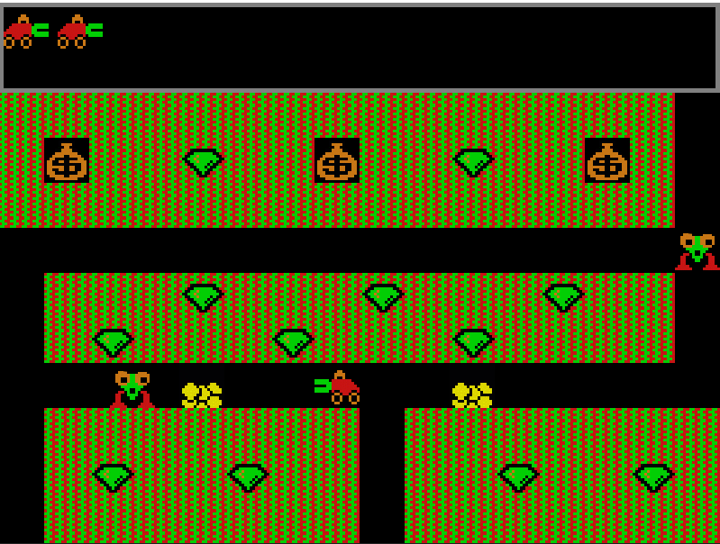

# Digger

## Game Description
Digger is an arcade game in which the player controls a motorized Diggermobile while collecting gold and precious emeralds underground. However, underground the player is pursued by dangerous monsters - nobbins. The game world consists of levels, where each level is a 15x10 rectangular grid.

## Game Features
- The player controls the Diggermobile and can dig tunnels, collect emeralds and gold.
- Monsters (nobbins) are chasing the Diggermobile and can kill the player.
- The goal of the level is to collect all the emeralds or destroy all the monsters.
- Bags of gold can be pushed by the Diggermobile and create a pile of gold that can be collected.
- Monsters can be destroyed with fireballs fired by the Diggermobile.

## Project organization
The project is organized as follows:

- The main game loop and window output are in the file `digger.cpp`.
- The `Game` class controls the game, including loading the map and objects, and updating the game state.
- The `Map` class stores matrices of game cells.
- The `Counter` counter is used to count down the time until events.
- `GameObject` - an abstract object from which all other game objects (Player, Emerald, Enemy, Fireball, Gold, GoldBag) are inherited. Each object has access to a list of objects and a map.

## Resources
Game maps and sprites are stored in the `data` directory.

## How to play
1. Use the Diggermobile controls to navigate underground and collect treasures.
2. Beware of nobbins, they can kill you.
3. Collect all the emeralds or destroy all the monsters to complete the level.
4. Use fire balls to destroy monsters.

## Requirements
- C++ compiler
- Library for creating graphical applications (SFML)

## Screenshot

